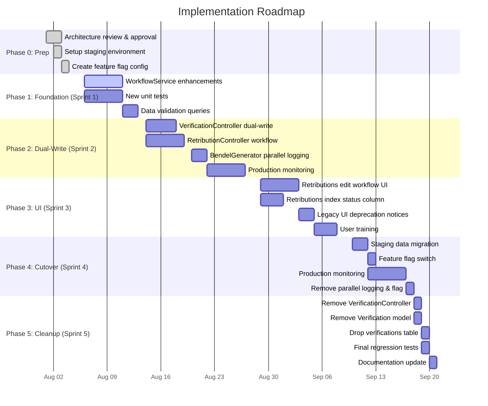

# Architecture Mapping: Legacy Verification → WorkflowService Migration

## Document Status

| Field | Value |
|-------|-------|
| **Title** | Migration Blueprint: Legacy Verification to WorkflowService |
| **Version** | 1.0 |
| **Author** | Architecture Team |
| **Status** | Draft — Planning Only |
| **No code changes** | ✅ This document is a planning artifact only |

---

## 1. Executive Summary

The SIPADU-DAGANG system currently has **two parallel verification mechanisms** for retribution (retribution) billing:

1. **Legacy Verification Module** — A standalone `verifications` table with CRUD operations, `Pending`/`Terverifikasi` statuses, and its own `nomor_setor`, `tanggal_verifikasi`, and `verified_by` fields.
2. **WorkflowService** — A state machine embedded in the `retributions` table (`draft → submitted → verified → approved → locked`) with full audit trail via `WorkflowLog`.

**Problem:** The `BendelGenerator` still reads from the legacy `verifications` table (`WHERE status = 'Terverifikasi'`), creating a fragmented architecture where:
- Data redundancy exists between `verifications` and `retributions` tables
- Workflow state is split across two systems
- Bendel generation depends on a deprecated module
- Users must interact with two separate interfaces (Verifikasi + Retribusi) for what should be a single workflow

**Goal:** Migrate all verification logic to the WorkflowService, retire the legacy `verifications` table, and update `BendelGenerator` to read from `retributions.status = 'verified'` — **without breaking production behavior**.

---

## 2. Current Production Architecture

### 2.1 Data Flow Diagram (Current)

```
┌──────────────┐     ┌──────────────┐     ┌──────────────────┐
│  Petugas     │     │  OCR Module  │     │  Retribution     │
│  (Input      │────>│  (Gemini AI  │────>│  Controller      │
│   Retribusi) │     │   Scan)      │     │  (Store/Update)  │
└──────────────┘     └──────────────┘     └────────┬─────────┘
                                                   │
                                                   ▼
                                          ┌──────────────────┐
                                          │  retributions    │
                                          │  table           │
                                          │  ────────────    │
                                          │  status: 'draft' │
                                          │  amount, etc.    │
                                          └────────┬─────────┘
                                                   │
                    ┌──────────────────────────────┼──────────────────────┐
                    │                              │                      │
                    ▼                              ▼                      ▼
        ┌──────────────────────┐    ┌──────────────────────┐   ┌──────────────────┐
        │  Verification        │    │  WorkflowService     │   │  Dashboard       │
        │  Controller          │    │  (submit/verify/     │   │  AggregateService│
        │  (CRUD on            │    │   approve/lock)      │   │  (reads ALL      │
        │   verifications)     │    │  ~~~~~~~~~           │   │   retributions   │
        │                      │    │  Written & tested    │   │   regardless of  │
        │  verifications       │    │  but NOT connected   │   │   status)        │
        │  ───────────         │    │  to UI or Bendel     │   └──────────────────┘
        │  status:             │    │                      │
        │  'Pending'           │    │  retributions        │
        │  'Terverifikasi'     │    │  ───────────         │
        │                      │    │  status transitions  │
        │  Has:                │    │  draft→submitted     │
        │  - nomor_setor       │    │  submitted→verified  │
        │  - tanggal_verifikasi│    │  verified→approved   │
        │  - verified_by       │    │  approved→locked     │
        │  - catatan           │    │                      │
        └──────────┬───────────┘    └──────────────────────┘
                   │
                   ▼
        ┌──────────────────────┐
        │  BendelGenerator     │
        │  ───────────         │
        │  Reads FROM:         │
        │  verifications       │
        │  WHERE status =      │
        │  'Terverifikasi'     │
        │                      │
        │  Writes TO:          │
        │  bendels             │
        │  bendel_documents    │
        │  bendel_document_items│
        └──────────────────────┘
```

### 2.2 Current Module Responsibilities

| Module | Reads From | Writes To | Key Statuses | Authored By |
|--------|-----------|-----------|--------------|-------------|
| `RetributionController` | `retributions` | `retributions` | `draft` (default) | `recorded_by` |
| `VerificationController` | `verifications` | `verifications` | `Pending`, `Terverifikasi` | `verified_by` |
| `WorkflowService` | `retributions` | `retributions`, `workflow_logs` | `draft`→`submitted`→`verified`→`approved`→`locked` | `submitted_by`, `verified_by`, `approved_by`, `locked_by` |
| `BendelGenerator` | `verifications` | `bendels`, `bendel_documents`, `bendel_document_items` | Filters `Terverifikasi` | `created_by` |
| `AggregateService` | `retributions` | N/A (read-only) | Ignores status (reads ALL) | N/A |
| `DashboardController` | `retributions` (via Aggregate) | N/A | Ignores status | N/A |

### 2.3 Current Table Schema (Relevant Columns)

**`retributions` table:**
| Column | Type | Current Usage |
|--------|------|---------------|
| `status` | varchar(255), default 'draft' | WorkflowService transitions |
| `submitted_at` | timestamp nullable | Set by WorkflowService::submit() |
| `submitted_by` | FK→users nullable | Set by WorkflowService::submit() |
| `verified_at` | timestamp nullable | Set by WorkflowService::verify() |
| `verified_by` | FK→users nullable | Set by WorkflowService::verify() |
| `approved_at` | timestamp nullable | Set by WorkflowService::approve() |
| `approved_by` | FK→users nullable | Set by WorkflowService::approve() |
| `locked_at` | timestamp nullable | Set by WorkflowService::lock() |
| `locked_by` | FK→users nullable | Set by WorkflowService::lock() |
| `nomor_setor` | varchar nullable | Added in migration, NOT currently used by any controller |

**`verifications` table (Legacy):**
| Column | Type | Current Usage |
|--------|------|---------------|
| `retribution_id` | FK→retributions | Links to parent retribution |
| `nomor_setor` | varchar nullable | Set by VerificationController |
| `tanggal_verifikasi` | date nullable | Set by VerificationController |
| `status` | enum('Pending','Terverifikasi'), default 'Pending' | Used by BendelGenerator filter |
| `catatan` | text nullable | Notes from verifier |
| `verified_by` | FK→users nullable | Who performed verification |

**`workflow_logs` table:**
| Column | Type | Current Usage |
|--------|------|---------------|
| `user_id` | FK→users nullable | Actor |
| `retribution_id` | FK→retributions | Target |
| `action` | varchar | e.g., 'SUBMIT', 'VERIFY', 'APPROVE', 'LOCK' |
| `old_status` | varchar nullable | Previous state |
| `new_status` | varchar | New state |
| `description` | text nullable | Auto-generated |

---

## 3. Desired Future Architecture

### 3.1 Data Flow Diagram (Future)

```
┌──────────────┐     ┌──────────────┐     ┌──────────────────┐
│  Petugas     │     │  OCR Module  │     │  Retribution     │
│  (Input      │────>│  (Gemini AI  │────>│  Controller      │
│   Retribusi) │     │   Scan)      │     │  (Store/Update)  │
└──────────────┘     └──────────────┘     └────────┬─────────┘
                                                   │
                                                   ▼
                                          ┌──────────────────┐
                                          │  retributions    │
                                          │  table           │
                                          │  status: 'draft' │
                                          └────────┬─────────┘
                                                   │
                    ┌──────────────────────────────┼──────────────────────┐
                    │                              │                      │
                    ▼                              ▼                      ▼
        ┌──────────────────────┐    ┌──────────────────────┐   ┌──────────────────┐
        │  RetributionController│   │  WorkflowService     │   │  Dashboard       │
        │  (NEW: workflow      │    │  (submit/verify/     │   │  AggregateService│
        │   action buttons)    │    │   approve/lock)      │   │  (ADD: status    │
        │                      │    │                      │   │   filter for     │
        │  Calls WorkflowService│   │  Now ALSO reads      │   │   'verified'     │
        │  from UI             │    │  nomor_setor from    │   │   only)          │
        └──────────────────────┘    │  retributions table  │   └──────────────────┘
                                    └──────────┬───────────┘
                                               │
                                               ▼
                                    ┌──────────────────────┐
                                    │  BendelGenerator     │
                                    │  (UPDATED)           │
                                    │  ───────────         │
                                    │  Reads FROM:         │
                                    │  retributions        │
                                    │  WHERE status =      │
                                    │  'verified'          │
                                    │                      │
                                    │  Legacy verifications│
                                    │  table is IGNORED    │
                                    └──────────────────────┘

┌─────────────────────────────────────────────────────────────────┐
│  REMOVED:                                                      │
│  - VerificationController (deprecated)                         │
│  - verifications table (data migrated, table dropped)          │
│  - verifications views (index.blade.php, edit.blade.php)       │
└─────────────────────────────────────────────────────────────────┘
```

---

## 4. State Mapping Table

### 4.1 Status Transition Mapping

| Legacy `verifications.status` | New `retributions.status` | Transition Action | User Role Required | System Behavior |
|------------------------------|---------------------------|-------------------|--------------------|-----------------|
| *(no record exists)* | `draft` | *(initial state)* | Petugas | Retribution created; awaits submission |
| *(no record exists)* | `submitted` | `WorkflowService::submit()` | Petugas | Sets `submitted_at`, `submitted_by`; retribution is locked for editing |
| `Pending` | *(no direct equivalent)* | N/A | N/A | Pending means "submitted but not verified" → maps to `submitted` conceptually |
| `Terverifikasi` | `verified` | `WorkflowService::verify()` | Verifikator | Sets `verified_at`, `verified_by`; this is the gate for Bendel inclusion |
| *(no record exists)* | `approved` | `WorkflowService::approve()` | Approver (Admin) | Sets `approved_at`, `approved_by`; financial confirmation |
| *(no record exists)* | `locked` | `WorkflowService::lock()` | Admin/Lock | Sets `locked_at`, `locked_by`; terminal state, no further changes |

### 4.2 Field Mapping: Legacy → New

| Legacy `verifications` Field | New Location | Migration Strategy |
|------------------------------|--------------|--------------------|
| `id` | `retributions.verification_legacy_id` (optional) | Store reference for audit, or drop |
| `retribution_id` | `retributions.id` | Implicit via FK join |
| `nomor_setor` | `retributions.nomor_setor` | Field already exists on retributions (migrated in 2026_07_22_051000) |
| `tanggal_verifikasi` | `retributions.verified_at` | Convert to timestamp; date → datetime |
| `status` | `retributions.status` | `'Pending'` → `'submitted'`; `'Terverifikasi'` → `'verified'` |
| `catatan` | `retributions.notes` (append) or new `workflow_logs.description` | Append to existing notes or create initial WorkflowLog |
| `verified_by` | `retributions.verified_by` | Direct FK → FK mapping |

### 4.3 Role-Based Access Control Mapping

| User Role | Current Action (Legacy) | Future Action (WorkflowService) |
|-----------|------------------------|---------------------------------|
| `petugas` | Input retribusi, View verifikasi | Input retribusi, `submit()` retribution, View status |
| `verifikator` | Create/Edit verifikasi records, Set `Terverifikasi` | `verify()` retribution via button in Retribusi detail |
| `admin` | Full CRUD on verifications | `approve()` and `lock()` retributions; manage workflow |
| `bendahara` | Generate Bendel via Bendel menu | Generate Bendel via Bendel menu (no UI change, backend only) |

### 4.4 State Machine Diagram (WorkflowService)

```
                    ┌─────────┐
                    │  DRAFT  │  ← Initial state (default from factory)
                    └────┬────┘
                         │ submit()
                         ▼
                    ┌───────────┐
              ┌────>│ SUBMITTED │  ← Ready for verification
              │     └─────┬─────┘
              │           │ verify()
              │           ▼
              │     ┌──────────┐
              │     │ VERIFIED │  ← Eligible for Bendel inclusion
              │     └─────┬────┘
              │           │ approve()
              │           ▼
              │     ┌──────────┐
              │     │ APPROVED │  ← Financially confirmed
              │     └─────┬────┘
              │           │ lock()
              │           ▼
              │     ┌──────────┐
              │     │  LOCKED  │  ← Terminal state
              │     └──────────┘
              │
              └─── (No reverse transitions allowed)
```

**Key property:** The state machine is **unidirectional**. There is no mechanism to move backward (e.g., `verified` → `submitted`). This is by design in `WorkflowService::canChangeStatus()`.

---

## 5. Dependency Matrix

### 5.1 Coupling Analysis

| Component | Depends On | Used By | Impact if Changed |
|-----------|-----------|---------|-------------------|
| `VerificationController` | `Verification` model | Routes (web.php) | High — UI for verification |
| `Verification` model | `retributions` table | `VerificationController`, `BendelGenerator` | Critical — migration target |
| `WorkflowService` | `Retribution` model, `WorkflowLog` model | No controller calls it yet | Low — it's an orphan service |
| `BendelGenerator` | `Verification` model | `BendelController` | Critical — must be re-pointed |
| `AggregateService` | `Retribution` model | `DashboardController`, `RekapHarianController` | Low — reads all statuses currently |
| `RetributionController` | `Retribution` model | Routes (web.php) | Medium — needs workflow action endpoints |
| Dashboard views | `AggregateService` | End users | Low — cosmetic only |
| Sidebar navigation | Route names | End users | Low — may need to rename menu items |

### 5.2 Call Graph (Current)

```
web.php
├── RetributionController::index/create/store/show/edit/update/destroy
│   └── Retribution model
├── VerificationController::index/create/store/show/edit/update/destroy
│   └── Verification model
│       └── Retribution model (belongsTo)
├── BendelController::index/generate
│   └── BendelGenerator::generate()
│       └── Verification::where('status','Terverifikasi')
│           └── Retribution model (belongsTo via Verification)
├── DashboardController
│   └── AggregateService
│       └── Retribution model (no status filter)
└── RekapHarianController
    └── AggregateService
```

### 5.3 Call Graph (Future)

```
web.php
├── RetributionController::index/create/store/show/edit/update/destroy
│   ├── Retribution model
│   └── WorkflowService::submit() / verify() / approve() / lock()  ← NEW
│       └── Retribution model
│       └── WorkflowLog model
├── [REMOVED] VerificationController
├── BendelController::index/generate
│   └── BendelGenerator::generate()  ← UPDATED
│       └── Retribution::where('status','verified')  ← CHANGED
├── DashboardController
│   └── AggregateService  ← UPDATED (status filter optional)
└── RekapHarianController
    └── AggregateService  ← UPDATED (status filter optional)
```

---

## 6. Required Controller Changes

### 6.1 `VerificationController.php` — Deprecation Path

| Method | Action | Priority |
|--------|--------|----------|
| `index()` | **Phase 1**: Redirect to `retributions.index` with `status=verified` filter. **Phase 2**: Remove route and controller. | High |
| `create()` | **Phase 1**: Show deprecation notice, redirect to `retributions.edit` with workflow action buttons. **Phase 2**: Remove. | High |
| `store()` | **Phase 1**: Add logic to ALSO call `WorkflowService::verify()` on the associated retribution. **Phase 2**: Remove. | High |
| `edit()` | **Phase 1**: Show deprecation notice, redirect to `retributions.edit` with workflow UI. **Phase 2**: Remove. | High |
| `update()` | **Phase 1**: Add logic to ALSO update `retributions.nomor_setor` and call `WorkflowService::verify()`. **Phase 2**: Remove. | High |
| `destroy()` | **Phase 1**: Keep for rollback. **Phase 2**: Remove. | Low |

### 6.2 `RetributionController.php` — New Workflow Actions

| Method | Action | Details |
|--------|--------|---------|
| `submit(Retribution $retribution)` | **NEW** | Call `WorkflowService::submit()`. Guard: only `draft` status. |
| `verify(Retribution $retribution, Request $request)` | **NEW** | Accept `nomor_setor` and `catatan` input. Update `retributions.nomor_setor`. Call `WorkflowService::verify()`. |
| `approve(Retribution $retribution)` | **NEW** | Call `WorkflowService::approve()`. Guard: only `verified` status. |
| `lock(Retribution $retribution)` | **NEW** | Call `WorkflowService::lock()`. Guard: only `approved` status. |
| `index()` | **MODIFY** | Add filter for `status` parameter (e.g., `?status=submitted`). |
| `show()` or `edit()` | **MODIFY** | Add workflow action buttons depending on current `retributions.status`. Show `nomor_setor` field for verification step. |

### 6.3 `BendelController.php` — Minimal Change

| Method | Action | Details |
|--------|--------|---------|
| `generate()` | **MODIFY** | No change to controller method signature. The change is in `BendelGenerator` (see §7.2). |

### 6.4 `DashboardController.php` — Potential Change

| Method | Action | Details |
|--------|--------|---------|
| `__invoke()` | **OPTIONAL** | Add status filter if we want dashboard to only show non-draft retributions, or show workflow stats (e.g., count of submitted vs verified). |

### 6.5 Routes (`web.php`) — Changes

```php
// REMOVE (Phase 2):
// Route::resource('verifications', VerificationController::class);

// ADD (Phase 1):
Route::prefix('retributions')->name('retributions.')->group(function () {
    Route::post('/{retribution}/submit', [RetributionController::class, 'submit'])->name('submit');
    Route::post('/{retribution}/verify', [RetributionController::class, 'verify'])->name('verify');
    Route::post('/{retribution}/approve', [RetributionController::class, 'approve'])->name('approve');
    Route::post('/{retribution}/lock', [RetributionController::class, 'lock'])->name('lock');
});

// Keep but redirect (Phase 1):
// Route::resource('verifications', VerificationController::class)
//     ->with(['index' => 'retributions.index', 'create' => 'retributions.index', ...]);
```

---

## 7. Required Service Changes

### 7.1 `WorkflowService.php` — Enhancements

| Change | Description | Priority |
|--------|-------------|----------|
| **Add `getVerifiedRetributions()` method** | `Retribution::where('status', 'verified')->with(['market', 'items'])->get()` — replaces the `Verification::where('status','Terverifikasi')` query currently in `BendelGenerator`. | **Critical** |
| **Add `verifyWithNomorSetor()` method** | Combines setting `nomor_setor` on the retribution record + calling `verify()`. This replaces the `VerificationController::store()` logic. | High |
| **Add `getAvailableTransitions()` method** | Returns allowed next statuses for a given retribution. Useful for UI button rendering. | Medium |
| **Add `canTransitionTo()` check** | Public wrapper around `canChangeStatus()` for UI permission checks without performing the transition. | Medium |

**Pseudocode for new methods:**

```php
// In WorkflowService.php

/**
 * Get all retributions that are eligible for Bendel generation.
 * Replaces: Verification::where('status', 'Terverifikasi')->get()
 */
public function getVerifiedRetributions(): \Illuminate\Support\Collection
{
    return Retribution::with(['market', 'items'])
        ->where('status', 'verified')
        ->get();
}

/**
 * Verify a retribution and store the nomor_setor in one call.
 * Replaces: VerificationController::store()
 */
public function verifyWithNomorSetor(
    Retribution $retribution,
    string $nomorSetor,
    ?string $catatan = null
): Retribution {
    return DB::transaction(function () use ($retribution, $nomorSetor, $catatan) {
        $retribution->update(['nomor_setor' => $nomorSetor]);
        
        $result = $this->verify($retribution);
        
        if ($catatan) {
            WorkflowLog::create([
                'user_id' => Auth::id(),
                'retribution_id' => $retribution->id,
                'action' => 'NOTE',
                'old_status' => $result->status,
                'new_status' => $result->status,
                'description' => $catatan,
            ]);
        }
        
        return $result;
    });
}

/**
 * Get list of valid next statuses for UI rendering.
 */
public function getAvailableTransitions(Retribution $retribution): array
{
    $flows = [
        'draft'     => ['submitted'],
        'submitted' => ['verified'],
        'verified'  => ['approved'],
        'approved'  => ['locked'],
    ];
    
    return $flows[$retribution->status] ?? [];
}
```

### 7.2 `BendelGenerator.php` — Re-source to WorkflowService

**Critical Change:** Replace the dependency on `Verification` model with `WorkflowService::getVerifiedRetributions()`.

**Current code (to be replaced):**
```php
$verifications = Verification::with(['retribution.market'])
    ->where('status', 'Terverifikasi')
    ->get();
```

**New code:**
```php
$retributions = app(WorkflowService::class)->getVerifiedRetributions();
```

**Full change map for `BendelGenerator::generate()`:**

| Current Line | Uses | Replace With |
|-------------|------|-------------|
| `$verifications = Verification::with(...)->where('status','Terverifikasi')->get()` | `Verification` model | `app(WorkflowService::class)->getVerifiedRetributions()` |
| `if ($verifications->isEmpty())` | `$verifications` | `$retributions->isEmpty()` |
| `foreach ($verifications as $verification)` | `$verification->retribution` | `foreach ($retributions as $retribution)` |
| `$retribution = $verification->retribution` | Chained access | Direct `$retribution` access |
| `if (!$retribution) { continue; }` | Null check | Remove (no longer needed) |

**Dependency injection change:** Remove `use App\Models\Verification;` and add `use App\Services\WorkflowService;`.

### 7.3 `AggregateService.php` — Optional Status Awareness

| Method | Current Behavior | Proposed Change |
|--------|-----------------|-----------------|
| `getDailyRecap()` | Reads ALL retributions for date | Add optional `$status` parameter (default: null = all). When `'verified'`, filter by status. |
| `getGrandTotal()` | Sums ALL amounts for date | Add optional `$status` filter. |
| `getMarketSummary()` | Reads ALL retributions for date | Add optional `$status` filter. |

**Example filter addition pattern:**
```php
if ($status) {
    $query->where('status', $status);
}
```

This enables the dashboard to show "Verified Revenue" vs "Total Revenue".

---

## 8. Required UI Changes

### 8.1 `retributions/edit.blade.php` — Add Workflow Action Buttons

**New UI component needed:** Workflow action bar.

**Logic:**
```blade
{{-- Show based on retribution.status --}}
@if($retribution->status === 'draft')
    <form action="{{ route('retributions.submit', $retribution) }}" method="POST">
        @csrf
        <button type="submit" class="btn-primary">Submit untuk Verifikasi</button>
    </form>
@elseif($retribution->status === 'submitted')
    <div class="status-badge">Menunggu Verifikasi</div>
    
    {{-- Only show to verifikator/admin --}}
    @can('verify', $retribution)
        <form action="{{ route('retributions.verify', $retribution) }}" method="POST">
            @csrf
            <input type="text" name="nomor_setor" placeholder="Nomor Setor" required>
            <textarea name="catatan" placeholder="Catatan (opsional)"></textarea>
            <button type="submit" class="btn-success">Verifikasi</button>
        </form>
    @endcan
@elseif($retribution->status === 'verified')
    <div class="status-badge bg-green-100 text-green-700">Terverifikasi ✓</div>
    <p>Nomor Setor: {{ $retribution->nomor_setor }}</p>
    
    @can('approve', $retribution)
        <form action="{{ route('retributions.approve', $retribution) }}" method="POST">
            @csrf
            <button type="submit" class="btn-warning">Setujui (Approve)</button>
        </form>
    @endcan
@elseif($retribution->status === 'approved')
    <div class="status-badge bg-blue-100 text-blue-700">Disetujui</div>
    
    @can('lock', $retribution)
        <form action="{{ route('retributions.lock', $retribution) }}" method="POST">
            @csrf
            <button type="submit" class="btn-danger">Kunci (Lock)</button>
        </form>
    @endcan
@elseif($retribution->status === 'locked')
    <div class="status-badge bg-gray-100 text-gray-700">Terkunci 🔒</div>
@endif
```

### 8.2 `retributions/index.blade.php` — Add Status Column & Filter

| UI Element | Description |
|------------|-------------|
| **Status filter dropdown** | Filter by: All, Draft, Submitted, Verified, Approved, Locked |
| **Status column** | Show colored badge for each retribution's status |
| **Bulk action** (optional) | Select multiple retributions and perform workflow action (e.g., bulk submit) |

### 8.3 `verifications/index.blade.php` — Deprecate & Redirect

**Phase 1:** Replace page content with:
```blade
<div class="alert alert-warning">
    ⚠️ Halaman Verifikasi telah dipindahkan ke menu Retribusi.
    <a href="{{ route('retributions.index', ['status' => 'verified']) }}">
        Lihat Retribusi Terverifikasi
    </a>
</div>
```

### 8.4 `verifications/edit.blade.php` — Deprecate & Redirect

**Phase 1:** Replace with redirect notice pointing to `retributions.edit`.

### 8.5 `bendel/index.blade.php` — No UI Change Required

The Bendel form remains the same (tanggal_pendapatan, tanggal_setor). The backend change is transparent to the user.

### 8.6 Sidebar Navigation

| Current Menu | Change |
|-------------|--------|
| Verifikasi | **Phase 1:** Keep but add "(Pindah ke Retribusi)" label. **Phase 2:** Remove entirely. |
| Retribusi | **Phase 1:** Keep. **Phase 2:** Add workflow sub-actions or status badges. |

### 8.7 `resources/views/verifications/` — Complete File List

**Files to be deprecated/removed:**
- `resources/views/verifications/index.blade.php`
- `resources/views/verifications/edit.blade.php`
- *(Potential: create.blade.php is not referenced — check if it exists)*

---

## 9. Data Migration Strategy

### 9.1 Migration Overview

A **one-time data migration** is required to move existing records from `verifications` table into the `retributions` workflow fields. This is a **write-only migration** — no code changes to production behavior.

### 9.2 Migration Pseudocode

```php
// In a new migration or seeder (e.g., 2026_08_01_000000_migrate_legacy_verifications_to_workflow.php)

// Step 1: Iterate over all legacy verification records
$verifications = DB::table('verifications')->get();

foreach ($verifications as $verification) {
    $retribution = Retribution::find($verification->retribution_id);
    
    if (!$retribution) {
        // Orphaned verification record — log and skip
        Log::warning("Orphaned verification #{$verification->id} for retribution #{$verification->retribution_id}");
        continue;
    }
    
    // Step 2: Map status
    $newStatus = match($verification->status) {
        'Pending'       => 'submitted',
        'Terverifikasi' => 'verified',
        default         => 'submitted',
    };
    
    // Step 3: Only update if the new workflow fields are still null
    // (don't overwrite if WorkflowService was already used)
    $updateData = [
        'nomor_setor' => $verification->nomor_setor ?? $retribution->nomor_setor,
    ];
    
    if ($retribution->status === 'draft' || $retribution->status === null) {
        $updateData['status'] = $newStatus;
    }
    
    if ($retribution->verified_at === null && $verification->tanggal_verifikasi) {
        $updateData['verified_at'] = $verification->tanggal_verifikasi->startOfDay(); // date → datetime
        $updateData['verified_by'] = $verification->verified_by;
    }
    
    $retribution->update($updateData);
    
    // Step 4: Create a WorkflowLog entry for audit trail
    WorkflowLog::create([
        'user_id' => $verification->verified_by,
        'retribution_id' => $retribution->id,
        'action' => 'MIGRATE',
        'old_status' => $retribution->getOriginal('status') ?? 'draft',
        'new_status' => $updateData['status'] ?? $retribution->status,
        'description' => "Migrated from legacy verification #{$verification->id}. Nomor Setor: {$verification->nomor_setor}",
    ]);
}

// Step 5: Verify integrity
$orphanedRetributions = Retribution::whereNull('status')
    ->orWhere('status', 'draft')
    ->whereIn('id', $verifications->pluck('retribution_id'))
    ->count();

// Step 6: (Phase 2 only) Drop the legacy table
// Schema::dropIfExists('verifications');
```

### 9.3 Rollback Data Migration

If rollback is needed:
```php
// Reverse the migration by re-creating verification records from workflow data
$verifiedRetributions = Retribution::whereIn('status', ['submitted', 'verified'])->get();

foreach ($verifiedRetributions as $retribution) {
    DB::table('verifications')->updateOrInsert(
        ['retribution_id' => $retribution->id],
        [
            'nomor_setor' => $retribution->nomor_setor,
            'tanggal_verifikasi' => $retribution->verified_at?->toDateString(),
            'status' => $retribution->status === 'verified' ? 'Terverifikasi' : 'Pending',
            'verified_by' => $retribution->verified_by,
            'catatan' => 'Restored from workflow migration rollback',
        ]
    );
}
```

### 9.4 Data Validation Checks (Pre-Migration)

Run these checks before executing the migration:

```sql
-- 1. Find orphaned verification records (no matching retribution)
SELECT v.* FROM verifications v
LEFT JOIN retributions r ON r.id = v.retribution_id
WHERE r.id IS NULL;

-- 2. Find retributions that have BOTH legacy verification AND workflow data
SELECT r.id, r.status, r.verified_at, v.status as legacy_status
FROM retributions r
JOIN verifications v ON v.retribution_id = r.id
WHERE r.status IN ('verified', 'approved', 'locked');

-- 3. Find duplicate verifications for same retribution
SELECT retribution_id, COUNT(*) as cnt
FROM verifications
GROUP BY retribution_id
HAVING cnt > 1;
```

---

## 10. Backward Compatibility Strategy

### 10.1 Dual-Write Phase (Phase 1)

During Phase 1, **both** systems write data simultaneously:

```
User action                    Legacy verifications    retributions (workflow)
─────────────                  ────────────────────    ────────────────────────
Verify via legacy UI     →     INSERT/UPDATE            ALSO UPDATE via WorkflowService
Verify via new UI        →     NOT written              Written normally
Bendel generation        →     Read from legacy         (after cutover: read from new)
```

**Implementation:**
- `VerificationController::store()` — After saving to `verifications`, ALSO call `WorkflowService::verifyWithNomorSetor()` on the linked retribution.
- `VerificationController::update()` — After updating `verifications`, ALSO update `retributions.nomor_setor` and call `WorkflowService::verify()`.

This ensures data parity before the cutover.

### 10.2 Feature Flag

Introduce a configuration flag to control which source `BendelGenerator` reads from:

```php
// config/eret.php (or similar)
'workflow' => [
    'bendel_source' => env('BENDEL_SOURCE', 'legacy'), // 'legacy' or 'workflow'
],
```

In `BendelGenerator::generate()`:
```php
if (config('eret.workflow.bendel_source') === 'workflow') {
    $retributions = app(WorkflowService::class)->getVerifiedRetributions();
} else {
    $verifications = Verification::with('retribution.market')
        ->where('status', 'Terverifikasi')
        ->get();
    // ... existing logic
}
```

**Rollback:** Simply set `BENDEL_SOURCE=legacy` in `.env`.

### 10.3 API Backward Compatibility

If any external system or internal report reads from `verifications` table, we need:

1. **Database view** or **MySQL view** that mirrors `verifications` from `retributions` workflow data
2. Or a **Laravel model alias** that maps `Verification::query()` to read from retributions

**Example database view:**
```sql
CREATE VIEW verifications_view AS
SELECT
    r.id AS id,
    r.id AS retribution_id,
    r.nomor_setor,
    DATE(r.verified_at) AS tanggal_verifikasi,
    CASE
        WHEN r.status = 'submitted' THEN 'Pending'
        WHEN r.status = 'verified' THEN 'Terverifikasi'
        ELSE 'Pending'
    END AS status,
    r.notes AS catatan,
    r.verified_by,
    r.created_at,
    r.updated_at
FROM retributions r
WHERE r.status IN ('submitted', 'verified');
```

**Then in `Verification` model (temporary):**
```php
protected $table = 'verifications_view';
```

This makes the old controller work without the physical table.

---

## 11. Risk Assessment

### 11.1 Risk Matrix

| # | Risk | Probability | Impact | Mitigation |
|---|------|------------|--------|------------|
| R1 | **Data loss during migration** — records in `verifications` not properly mapped to `retributions` | Low | Critical | Dry-run migration in staging; run data validation queries before/after |
| R2 | **Race condition** — user verifies via legacy UI while another user submits via new UI | Medium | High | Dual-write in Phase 1; database transactions; pessimistic locking |
| R3 | **Bendel generation produces different results** after switching source | Medium | High | Run parallel generation in Phase 1 and compare outputs; use feature flag |
| R4 | **UI confusion** — users see two places to verify (Verifikasi menu + Retribusi action) | High | Medium | Clear deprecation notices; redirect legacy URLs; training session |
| R5 | **State machine deadlock** — no reverse transition available if user submits incorrectly | Medium | Medium | Add admin-only "reject" or "reset" transition; or document that only admin can fix via DB |
| R6 | **Performance impact** — `retributions` table is much larger than `verifications`, queries may slow down | Low | Medium | Add database index on `status` + `retribution_date`; optimize query |
| R7 | **Permission mismatch** — existing role middleware not aligned with workflow actions | Medium | High | Audit RoleMiddleware; ensure verifikator role has access to `verify()` action |
| R8 | **orphaned data** — bendel_document_items with retribution_id that doesn't exist after migration | Low | Medium | Foreign key constraints prevent this; add ON DELETE CASCADE handling |

### 11.2 Risk R1 — Detailed Mitigation: Data Migration Dry Run

```bash
# Before running migration in production:
# 1. Export current state
php artisan tinker --execute="
    \$vCount = DB::table('verifications')->count();
    \$rCount = Retribution::whereIn('status', ['submitted','verified'])->count();
    echo \"Verifications: \$vCount\nRetributions (workflow): \$rCount\n\";
"

# 2. Run migration in staging with --pretend
php artisan migrate --pretend --path=database/migrations/2026_08_01_000000_migrate_legacy_verifications_to_workflow.php

# 3. Run comparison query post-migration
# Expected: COUNT(verifications) === COUNT(retributions WHERE status IN ('submitted','verified'))
```

### 11.3 Risk R3 — Detailed Mitigation: Parallel Bendel Generation

In Phase 1, before removing the legacy source:

```php
// In BendelGenerator, temporarily log comparison
$legacyCount = Verification::where('status', 'Terverifikasi')->count();
$workflowCount = Retribution::where('status', 'verified')->count();

if ($legacyCount !== $workflowCount) {
    Log::warning("Bendel source mismatch: Legacy=$legacyCount, Workflow=$workflowCount");
    
    // Log the IDs that differ
    $legacyIds = Verification::where('status','Terverifikasi')->pluck('retribution_id');
    $workflowIds = Retribution::where('status','verified')->pluck('id');
    
    Log::info("Only in legacy: " . $legacyIds->diff($workflowIds)->implode(','));
    Log::info("Only in workflow: " . $workflowIds->diff($legacyIds)->implode(','));
}
```

---

## 12. Rollback Strategy

### 12.1 When to Rollback

Trigger conditions:
- Bendel generation produces wrong totals compared to previous day
- Data integrity check shows mismatched counts
- User reports inability to verify retributions
- Any 500 error in production related to workflow

### 12.2 Rollback Procedure

```
Step 1: Set feature flag to legacy
    echo "BENDEL_SOURCE=legacy" >> .env
    php artisan config:cache

Step 2: Restore legacy routes
    # Uncomment VerificationController routes in web.php
    # Revert route redirects

Step 3: Restore VerificationController
    # Revert any modifications made to store()/update()
    # Remove calls to WorkflowService from legacy controller

Step 4: Run reverse data migration
    php artisan db:seed --class=ReverseWorkflowMigrationSeeder

Step 5: Verify
    # Confirm Bendel generates same results as before
    # Confirm verifications.index page works
```

### 12.3 Rollback Time Estimate

| Action | Time | Dependencies |
|--------|------|-------------|
| Set feature flag | 1 minute | Access to production server |
| Restore routes from VCS | 2 minutes | Git revert on web.php |
| Restore VerificationController | 2 minutes | Git revert on controller |
| Run reverse migration | 5 minutes | Seed file must exist |
| Verify | 10 minutes | Manual QA |
| **Total** | **~20 minutes** | |

---

## 13. Sprint Breakdown

### 13.1 Sprint 1 — Foundation (Week 1-2)

**Goal:** Prepare the groundwork. No user-facing changes.

| Task | Files Affected | Effort | Dependencies |
|------|---------------|--------|-------------|
| Add `getVerifiedRetributions()` to WorkflowService | `app/Services/WorkflowService.php` | 1 hour | None |
| Add `verifyWithNomorSetor()` to WorkflowService | `app/Services/WorkflowService.php` | 2 hours | None |
| Add `getAvailableTransitions()` to WorkflowService | `app/Services/WorkflowService.php` | 30 min | None |
| Add `canTransitionTo()` public method | `app/Services/WorkflowService.php` | 30 min | None |
| Write unit tests for new WorkflowService methods | `tests/Unit/WorkflowServiceTest.php` | 3 hours | New methods |
| Write BendelGenerator comparison test | `tests/Feature/WorkflowRegressionTest.php` | 2 hours | Existing tests |
| Write data validation queries | Migration script | 1 hour | None |
| **Sprint 1 Acceptance Criteria:** All new WorkflowService methods have passing tests. No changes to production behavior. |

### 13.2 Sprint 2 — Dual-Write & Controller Changes (Week 3-4)

**Goal:** Both systems write simultaneously. Bendel comparisons running.

| Task | Files Affected | Effort | Dependencies |
|------|---------------|--------|-------------|
| Modify `VerificationController::store()` to dual-write | `app/Http/Controllers/VerificationController.php` | 2 hours | Sprint 1 |
| Modify `VerificationController::update()` to dual-write | `app/Http/Controllers/VerificationController.php` | 2 hours | Sprint 1 |
| Add workflow routes to web.php | `routes/web.php` | 30 min | None |
| Add `submit/verify/approve/lock` methods to RetributionController | `app/Http/Controllers/RetributionController.php` | 4 hours | Sprint 1 |
| Add status filter to `RetributionController::index()` | `app/Http/Controllers/RetributionController.php` | 1 hour | None |
| Add `nomor_setor` handling to RetributionController::update() | `app/Http/Controllers/RetributionController.php` | 1 hour | None |
| Add parallel logging to BendelGenerator | `app/Services/BendelGenerator.php` | 2 hours | Sprint 1 |
| Run Bendel comparison in production (monitor) | Monitoring | 1 week | N/A |
| **Sprint 2 Acceptance Criteria:** Legacy UI still works. New workflow routes work. Dual-write produces identical data. BendelGenerator logs comparison without affecting output. |

### 13.3 Sprint 3 — UI Migration (Week 5-6)

**Goal:** Users start using new workflow UI. Legacy UI shows deprecation notices.

| Task | Files Affected | Effort | Dependencies |
|------|---------------|--------|-------------|
| Add workflow action buttons to `retributions/edit.blade.php` | `resources/views/retributions/edit.blade.php` | 4 hours | Sprint 2 |
| Add status column to `retributions/index.blade.php` | `resources/views/retributions/index.blade.php` | 2 hours | Sprint 2 |
| Add status filter dropdown | `resources/views/retributions/index.blade.php` | 2 hours | Sprint 2 |
| Update `VerificationController` to redirect | `app/Http/Controllers/VerificationController.php` | 1 hour | None |
| Update `verifications/index.blade.php` with deprecation notice | `resources/views/verifications/index.blade.php` | 1 hour | None |
| Update sidebar navigation | `resources/views/layouts/sidebar.blade.php` | 30 min | None |
| User training / documentation | Documentation | 8 hours | All above |
| **Sprint 3 Acceptance Criteria:** Users can perform full workflow from retributions UI. Legacy verification menu redirects. Sidebar shows updated navigation. Training completed. |

### 13.4 Sprint 4 — Cutover (Week 7-8)

**Goal:** Switch BendelGenerator to WorkflowService. Run data migration.

| Task | Files Affected | Effort | Dependencies |
|------|---------------|--------|-------------|
| Run data migration (staging) | Migration script | 1 hour | Sprint 3 |
| Verify data integrity post-migration | SQL queries | 2 hours | Migration done |
| Switch feature flag to `workflow` | `.env` | 30 min | All previous |
| Monitor Bendel generation for 3 days | Production monitoring | 3 days | Feature flag switch |
| Remove parallel logging from BendelGenerator | `app/Services/BendelGenerator.php` | 30 min | 3-day monitoring |
| Remove dual-write from VerificationController | `app/Http/Controllers/VerificationController.php` | 1 hour | Monitoring passed |
| Remove feature flag config | `config/eret.php` | 30 min | All above |
| **Sprint 4 Acceptance Criteria:** BendelGenerator uses WorkflowService exclusively. Data migration successful. No errors in production for 3 days. Feature flag removed. |

### 13.5 Sprint 5 — Cleanup (Week 9-10)

**Goal:** Remove legacy code entirely.

| Task | Files Affected | Effort | Dependencies |
|------|---------------|--------|-------------|
| Remove VerificationController | `app/Http/Controllers/VerificationController.php` | 1 hour | Sprint 4 |
| Remove Verification model | `app/Models/Verification.php` | 30 min | Sprint 4 |
| Remove verifications views | `resources/views/verifications/` | 30 min | Sprint 4 |
| Drop verifications table migration | New migration file | 1 hour | Sprint 4 |
| Remove orphan verification routes | `routes/web.php` | 30 min | Sprint 4 |
| Update sidebar (remove verification menu) | `resources/views/layouts/sidebar.blade.php` | 30 min | Sprint 4 |
| Remove `verifications_view` if created | Schema | 30 min | Sprint 4 |
| Final regression test run | `php artisan test` | 1 hour | All above |
| Update README and documentation | `README.md` | 2 hours | All above |
| **Sprint 5 Acceptance Criteria:** No legacy verification code remains. All tests pass. Documentation updated. Database has no verifications table. |

---

## 14. Acceptance Criteria (Per Sprint)

### Sprint 1 — Foundation
- [ ] `WorkflowService::getVerifiedRetributions()` returns only retributions with `status = 'verified'`
- [ ] `WorkflowService::verifyWithNomorSetor()` updates `nomor_setor` and transitions to `verified`
- [ ] `WorkflowService::getAvailableTransitions()` returns correct next states for each status
- [ ] `WorkflowService::canTransitionTo()` returns boolean without performing transition
- [ ] All new methods have 100% test coverage
- [ ] Existing `tests/Feature/WorkflowRegressionTest.php` still passes
- [ ] No changes to any production behavior (controllers, views, routes remain untouched)

### Sprint 2 — Dual-Write & Controller Changes
- [ ] Legacy verification store() also writes to `retributions` via WorkflowService
- [ ] Legacy verification update() also updates `retributions.nomor_setor` and calls verify()
- [ ] New routes `/retributions/{id}/submit`, `/verify`, `/approve`, `/lock` return 200
- [ ] `RetributionController::index()` accepts `?status=` filter parameter
- [ ] `BendelGenerator` logs comparison between legacy and workflow sources without affecting output
- [ ] No regression in legacy verification functionality

### Sprint 3 — UI Migration
- [ ] Retributions edit page shows workflow action buttons based on current status
- [ ] Only users with correct role see each action button
- [ ] Nomor Setor field appears when verifying via retributions edit page
- [ ] Retributions index page shows status column with colored badges
- [ ] Retributions index page has status filter dropdown
- [ ] Verifications index page shows deprecation notice with redirect link
- [ ] Sidebar navigation updated
- [ ] All existing blade views compile without errors

### Sprint 4 — Cutover
- [ ] Data migration script runs successfully in staging
- [ ] Post-migration validation queries show zero data integrity issues
- [ ] `BENDEL_SOURCE=workflow` set; Bendel generation produces identical output to previous day
- [ ] Monitoring for 3 days shows no errors in Bendel generation or workflow actions
- [ ] All `workflow_logs` entries correctly show `MIGRATE` action for migrated records
- [ ] Feature flag config removed after monitoring period

### Sprint 5 — Cleanup
- [ ] `app/Http/Controllers/VerificationController.php` deleted
- [ ] `app/Models/Verification.php` deleted
- [ ] `resources/views/verifications/` directory deleted
- [ ] `verifications` table dropped (via migration)
- [ ] Verification routes removed from `routes/web.php`
- [ ] Sidebar no longer shows "Verifikasi" menu
- [ ] `php artisan test` passes with 100% success rate
- [ ] `README.md` updated to reflect new workflow

---

## 15. Recommended Implementation Order

### Phase 0 — Preparation (Before Any Code Changes)



### Priority Order (Detailed Steps)

```
STEP 1: WorkflowService enhancements (Sprint 1)
  ├── 1.1 Add getVerifiedRetributions()
  ├── 1.2 Add verifyWithNomorSetor()
  ├── 1.3 Add getAvailableTransitions()
  ├── 1.4 Add canTransitionTo()
  └── 1.5 Write tests

STEP 2: Dual-write in VerificationController (Sprint 2)
  ├── 2.1 Modify store() to call WorkflowService
  ├── 2.2 Modify update() to call WorkflowService
  └── 2.3 Write tests for dual-write

STEP 3: New workflow routes + controller methods (Sprint 2)
  ├── 3.1 Add routes in web.php
  ├── 3.2 Add submit/verify/approve/lock to RetributionController
  ├── 3.3 Add status filter to RetributionController::index()
  └── 3.4 Write tests for new endpoints

STEP 4: BendelGenerator parallel comparison (Sprint 2)
  ├── 4.1 Add logging for legacy vs workflow comparison
  ├── 4.2 Run in production (monitor)
  └── 4.3 Verify output parity

STEP 5: UI changes for new workflow (Sprint 3)
  ├── 5.1 Action buttons in retributions/edit.blade.php
  ├── 5.2 Status column + filter in retributions/index.blade.php
  └── 5.3 Deprecation notices in verifications views

STEP 6: Data migration (Sprint 4)
  ├── 6.1 Run migration in staging
  ├── 6.2 Validate data integrity
  └── 6.3 Run in production

STEP 7: Switch BendelGenerator to workflow source (Sprint 4)
  ├── 7.1 Set BENDEL_SOURCE=workflow
  ├── 7.2 Monitor for 3 days
  ├── 7.3 Remove parallel logging
  └── 7.4 Remove feature flag

STEP 8: Legacy code removal (Sprint 5)
  ├── 8.1 Remove VerificationController
  ├── 8.2 Remove Verification model
  ├── 8.3 Remove verifications views
  ├── 8.4 Drop verifications table
  ├── 8.5 Update routes
  ├── 8.6 Update sidebar
  └── 8.7 Final regression tests
```

### Phase Dependency Graph

```
Sprint 1 ────> Sprint 2 ────> Sprint 3 ────> Sprint 4 ────> Sprint 5
   │               │                          │               │
   │               │                          │               │
   ▼               ▼                          ▼               ▼
Foundation     Dual-Write/Cont.           UI Changes      Cutover/       Cleanup/
Enhancement    Changes + Parallel                         Data Mig.     Archive
(Tests pass)   (Both work)              (Users trained)  (Monitoring)   (Legacy removed)
```

---

## Appendix A: Key File Map

| File | Role in Migration |
|------|-------------------|
| `app/Services/WorkflowService.php` | **Enhance** — add new methods for Bendel source and dual-write |
| `app/Services/BendelGenerator.php` | **Modify** — switch from Verification to Retribution model |
| `app/Http/Controllers/VerificationController.php` | **Phase 1: Modify** for dual-write; **Phase 5: Remove** |
| `app/Http/Controllers/RetributionController.php` | **Enhance** — add workflow action methods |
| `app/Http/Controllers/BendelController.php` | **No change** (BendelGenerator change is transparent) |
| `app/Models/Verification.php` | **Phase 1: Keep** for backward compat; **Phase 5: Remove** |
| `app/Models/Retribution.php` | **No change** (already has all workflow fields) |
| `app/Models/WorkflowLog.php` | **No change** |
| `resources/views/verifications/index.blade.php` | **Phase 3: Deprecate; Phase 5: Remove** |
| `resources/views/verifications/edit.blade.php` | **Phase 3: Deprecate; Phase 5: Remove** |
| `resources/views/retributions/index.blade.php` | **Enhance** — add status column + filter |
| `resources/views/retributions/edit.blade.php` | **Enhance** — add workflow action buttons |
| `resources/views/bendel/index.blade.php` | **No change** |
| `resources/views/layouts/sidebar.blade.php` | **Phase 3: Update** — deprecate verification menu |
| `routes/web.php` | **Phase 2: Add** workflow routes; **Phase 5: Remove** legacy routes |
| `config/eret.php` | **Phase 1: Add** feature flag; **Phase 4: Remove** |
| `database/migrations/2026_08_01_000000_*.php` | **New file** — data migration script (no schema change) |
| `tests/Feature/WorkflowRegressionTest.php` | **Enhance** — add tests for new WorkflowService methods |
| `.env` | **Phase 2: Add** `BENDEL_SOURCE=legacy`; **Phase 4: Switch** to `workflow` |

## Appendix B: State Transition Validation Matrix

| Current Status | Allowed Next Status | Action Method | Audit Fields Set |
|---------------|-------------------|---------------|------------------|
| `draft` | `submitted` | `submit()` | `submitted_at`, `submitted_by` |
| `submitted` | `verified` | `verify()` | `verified_at`, `verified_by` |
| `verified` | `approved` | `approve()` | `approved_at`, `approved_by` |
| `approved` | `locked` | `lock()` | `locked_at`, `locked_by` |
| `locked` | *(none)* | N/A | Terminal state |
| `draft` | `verified` | ❌ Exception thrown | N/A |
| `draft` | `approved` | ❌ Exception thrown | N/A |
| `submitted` | `approved` | ❌ Exception thrown | N/A |
| `verified` | `locked` | ❌ Exception thrown | N/A |

## Appendix C: Database Index Recommendations

After migration, consider adding these indexes to `retributions` table for query performance:

```sql
-- Already exists from migration 2026_07_22_041318:
-- INDEX on (status), INDEX on (retribution_date)

-- Additional indexes for common workflow queries:
CREATE INDEX retributions_status_date_idx ON retributions (status, retribution_date);
CREATE INDEX retributions_verified_at_idx ON retributions (verified_at);
CREATE INDEX retributions_submitted_by_idx ON retributions (submitted_by);
```

---

*End of Architecture Mapping Document. No code has been modified. This is a planning artifact only.*

